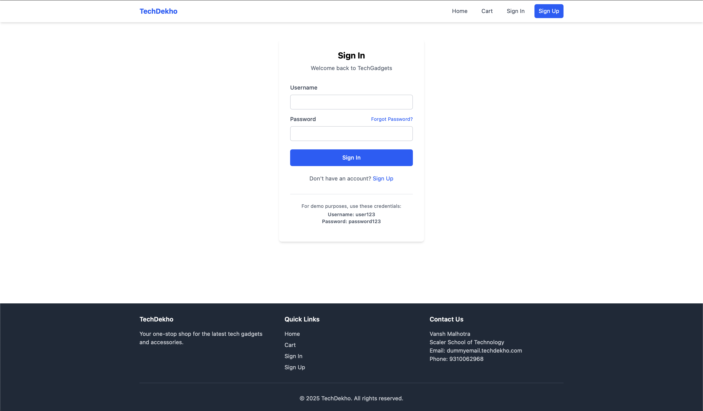
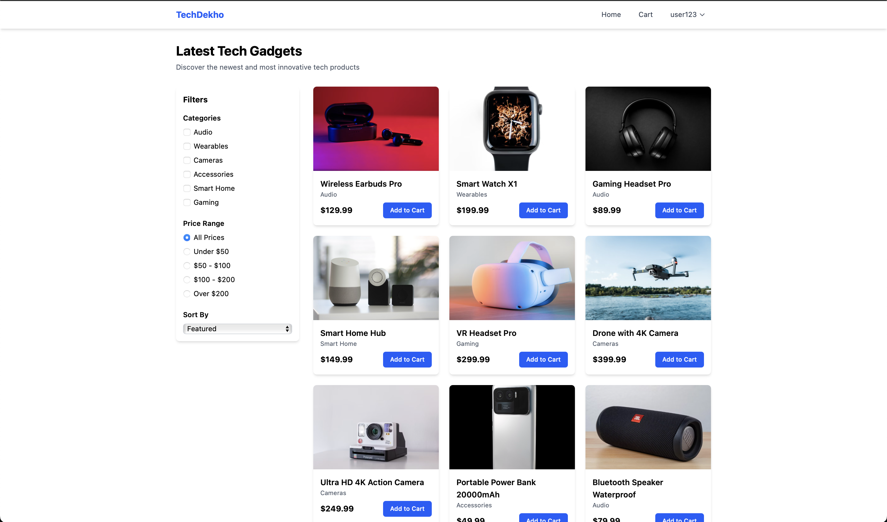
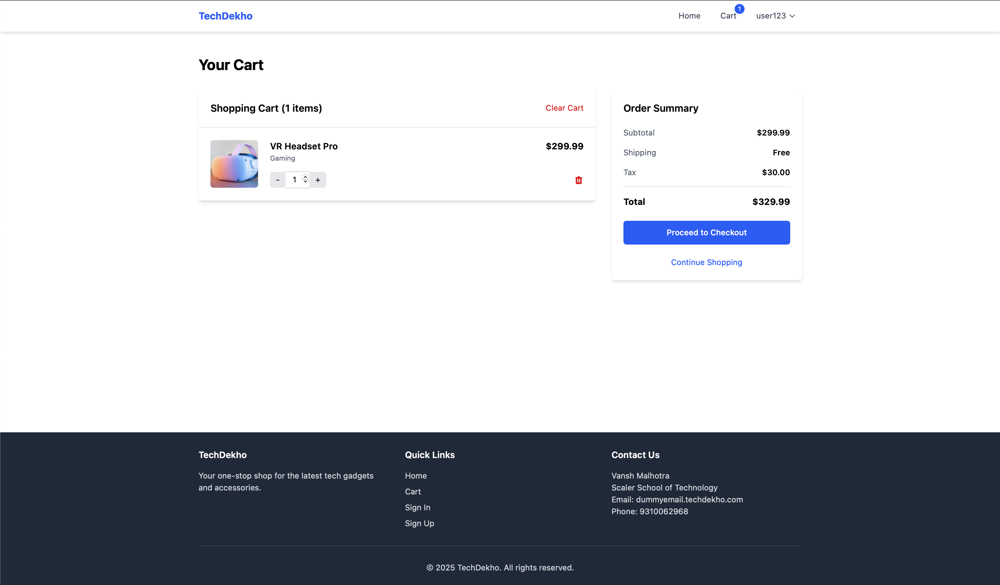

# 🛍️ TechDekho

**Live Site:** [https://ecom-demo-alpha.vercel.app](https://ecom-demo-alpha.vercel.app)

**Live Site:** [d2x26wbm9n196p.cloudfront.net](d2x26wbm9n196p.cloudfront.net)

TechDekho is a responsive e-commerce frontend built with **React**, **Tailwind CSS**, and **JavaScript**. It features modern UI components, product display, and smooth navigation—designed as a demo for modern e-commerce layouts.

---

## 🚀 Features

- ⚡ Fast and responsive design
- 💅 Styled with Tailwind CSS utility classes
- 🔄 Reusable components using React
- 📱 Mobile-first layout
- 🔧 Clean and simple project structure

---

## 📦 Tech Stack

- **React** – JavaScript library for building UI
- **Tailwind CSS** – Utility-first CSS framework
- **HTML & CSS** – Structure and basic styling
- **Vercel** – For deployment

---

## 🛠️ Getting Started

Follow these instructions to set up and run the project locally.

### 📋 Prerequisites

- [Node.js](https://nodejs.org/) (v14 or newer)
- [npm](https://www.npmjs.com/) 

### 📥 Installation

1. **Clone the repository:**

   ```bash
   git clone https://github.com/your-username/ecom-demo-alpha.git
   cd ecom-demo-alpha
2. **Install Dependencies**
    ```bash
   npm install
3. **Start The development server**
    ```bash
    npm run dev
4. open your browser and go to specified localhost

## 📸 Some Previews

1. signup Page


2. signin page

3. home page

4. cart page



